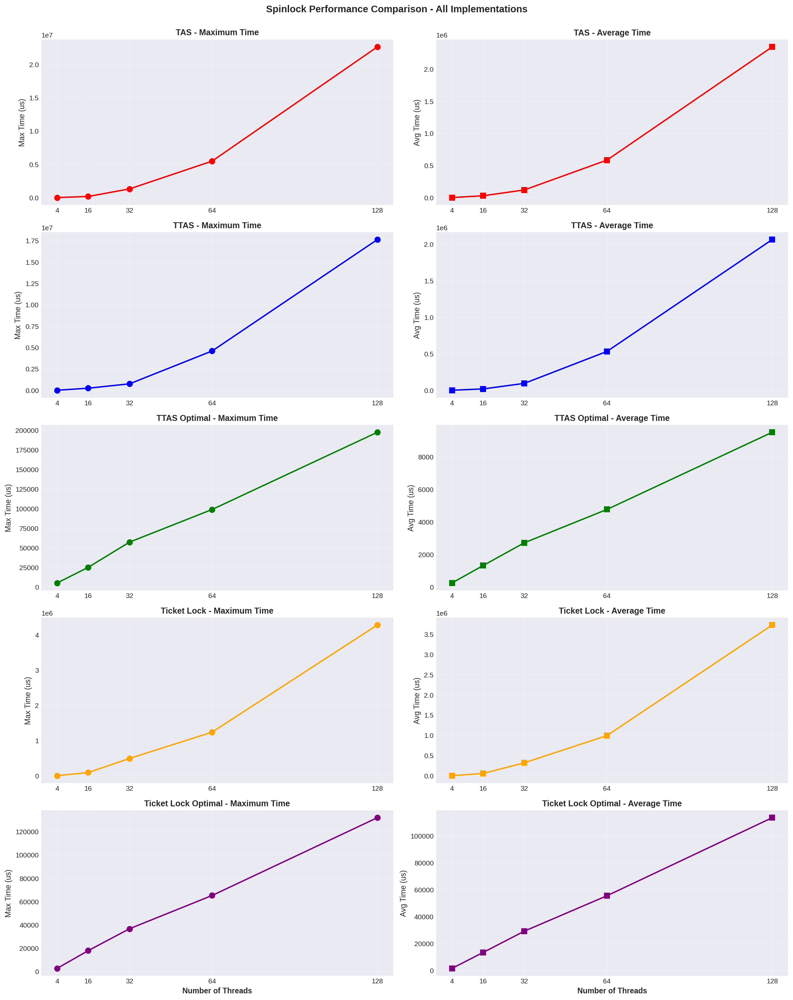
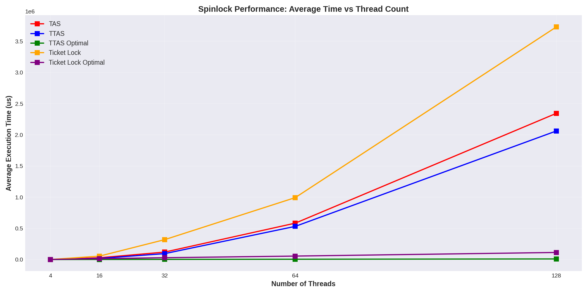
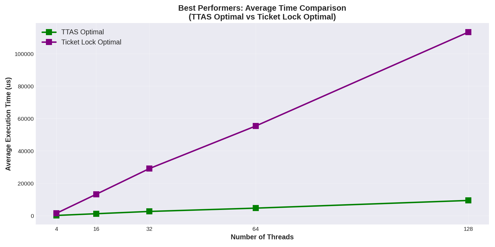
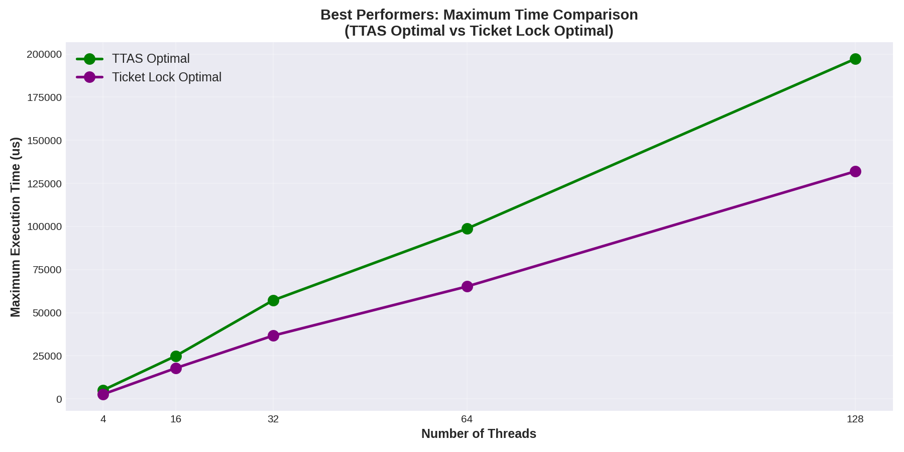
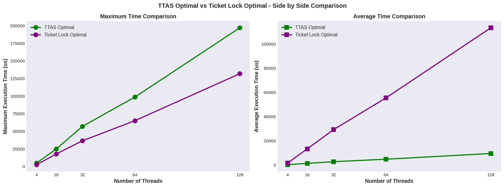
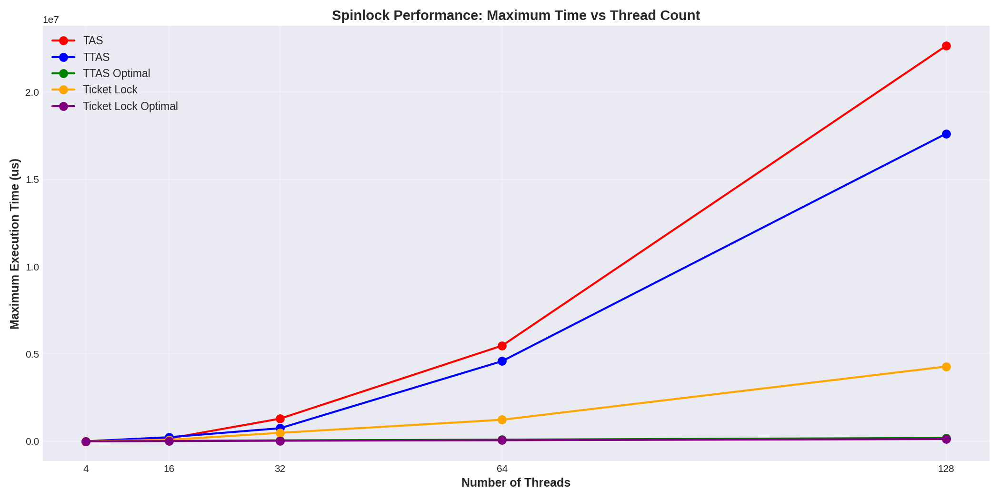

# Задача 3. Спинлоки

Реализовать TAS, TTAS & ticket lock с оптимизациями (pause, yield, backoff), построить графики -- среднее и максимальное время вхождения в крит. секцию от числа потоков. Обязательно корректная работа с барьерами памяти при обращении к атомарным переменным.

## Вопросы:
- барьеры памяти
- отложенный эффект операций
- синхронизация кэшей
- store buffer
- invalidate queue
- модели памяти C / C++
- свойства операции compare_exchange
- техники оптимизации
- честность
- чем ttas лучше tas
- в чём разница между спинлоком и мьютексом
- как можно сделать мьютекс

> Желающие получить балл побольше реализуют MCS lock / CLH lock.

## Графики

